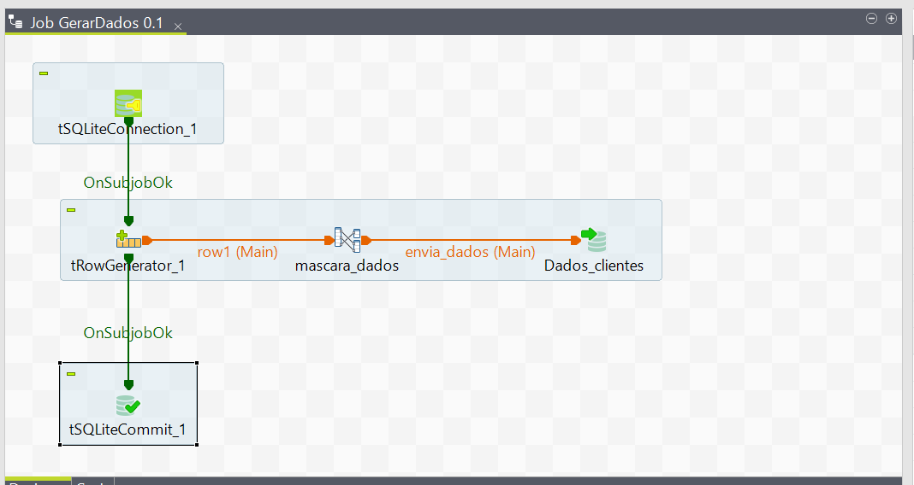

## Explicação – Mascaramento de Nome

Este job substitui nomes reais por nomes fictícios, utilizando uma lista randômica previamente definida. O objetivo é garantir anonimização sem perder a estrutura dos dados, permitindo testes com campos realistas.

O processo foi implementado no Talend com lógica de atualização (`UPDATE`) e integração ao fluxo de ETL. A estrutura nome + sobrenome foi mantida para preservar a consistência dos dados.

**Desafios enfrentados:**
- Evitar nomes repetidos em massa
- Preservar capitalização e formato original
- Garantir compatibilidade com sistemas que validam tamanho do campo

## 📸 Print do Job no Talend

